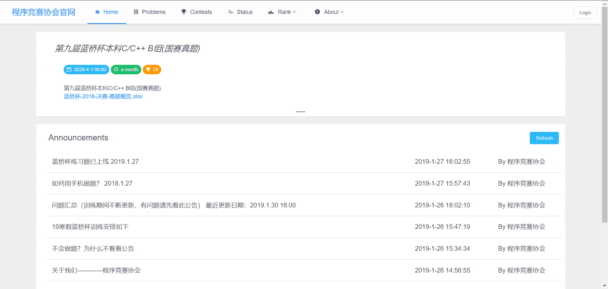
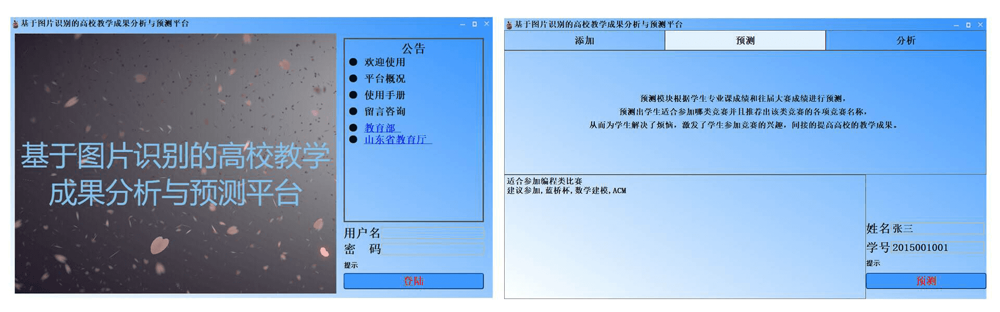
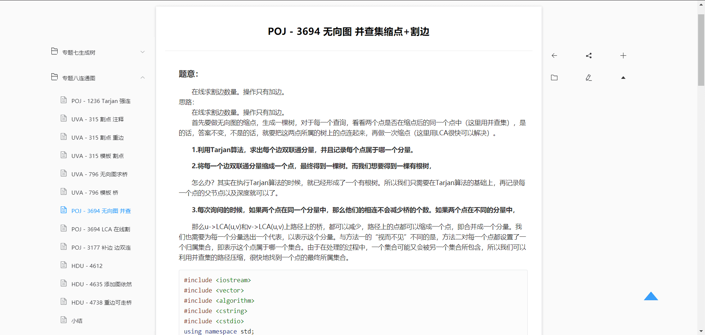
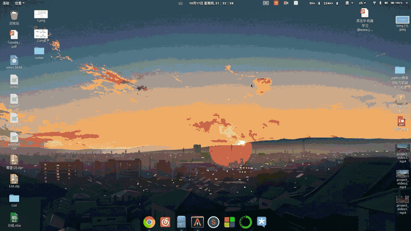
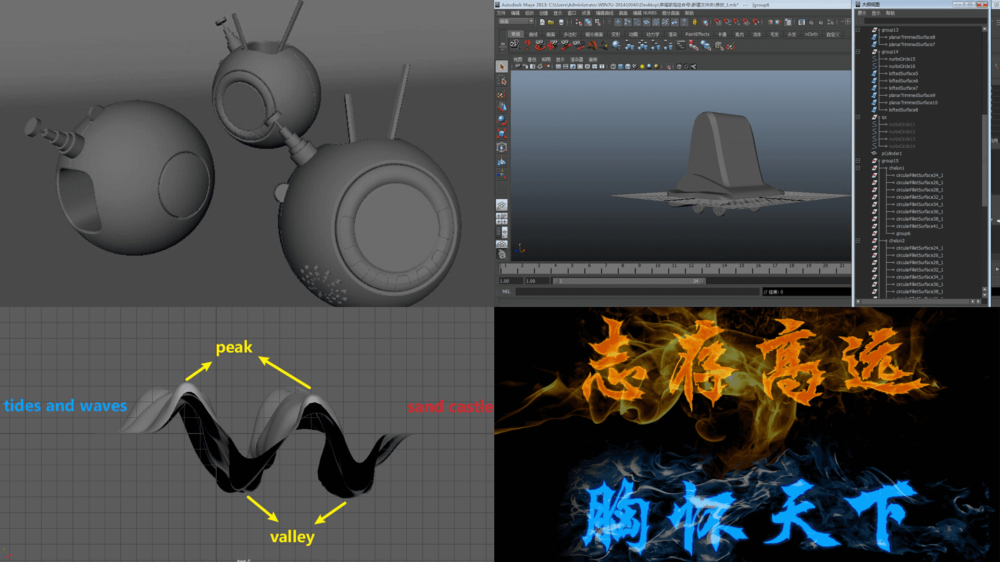

为了让各位老师更好地了解我，我将从**荣誉成绩**、**项目实践**和**综合能力**这三个方面展开介绍：

# 荣誉成绩

- 国际大学生程序设计竞赛秦皇岛现场赛国级优秀奖[2019.09]
- 国际大学生程序设计竞赛银川现场赛国级优秀奖[2019.10]
- 国际大学生程序设计竞赛西安全国总决赛优秀奖[2019.12]
- 蓝桥杯C/C++组国家三等奖[2019.05]
- 山东省高校大学生人工智能大赛特等奖[2019.10]
- 第七届发现杯互联网应用开发与设计华东赛区一等奖[2020.05]
- 第三届创青春创业大赛省级二等奖[2018.05]
- 团体程序设计天梯赛省级三等奖[2019.05]
- 山东省大学生创业计划大赛省级三等奖[2019.11]
- 山东省大学生移动互联创新创业大赛人工智能应用专项赛省级三等奖[2019.11]
- 2018学子访校友校级一等奖[2019.02]
- 挑战杯校级三等奖[2019.04]
- 华为杯计算机程序设计大赛校级三等奖[2017.11]
- 第二届编程大赛院特等奖[2018.05]
- 第二届营销大赛院第一名[2017.11]
- 2018寒假社会实践报告院级二等奖[2018.03]
- 院级科创部副部[2018-2019]
- 成立程序竞赛协会并担任会长[2018-2019]
- 计算机技术与软件专业技术资格中级软件设计师证[2018上半年]
- 计算机三级网络技术[2018上半年]
- 四级486
- 优秀团员(Top15%)
- 三好学生(Top5%两次)
- 一等奖学金(Top5%两次)

- **个人博客**

**
[https://www.bianzw.cn/](https://www.bianzw.cn/ "https://www.bianzw.cn/")（截止2020.4.1共237篇博文）
**

**
[网站数据统计报表](https://tongji.baidu.com/web/27175854/overview/index?siteId=12979707&fromMenu=top "网站数据统计报表")
**

# 项目

### 1人脸签到系统

- 人工智能模块由我完全实现
- 开发环境VS2015 + OpenCV3.4.1 + opencv_contrib
- 人脸识别：采用Siamese 网络，利用Triplet 损失，训练人脸识别模型
- 调用百度大脑开放AI分析人脸属性
- 数据库：Mysql
- 运动检测——光学识别的背景减法（延展内容）：获取单帧作为当前帧，对当前帧进行异常检测，将上一帧作为对比帧，对比帧和当前帧二值化转为灰度图并做差得差值图，差值图进行阈值化处理。对阈值化处理后的图做腐蚀(erode)和膨胀(dilate)操作，查找轮廓并绘制轮廓。【演示见下图】

### 2.综合测评网站（信息化统计审核量化分，部署供学院使用）

共经历两次版本迭代：

版本一：我担任主要负责人，负责完全**实现后端**内容（基于Flask框架开发），并**负责合并所有模块作最后项目部署和演示**。共六人开发团队，使用由我**搭建在个人服务器上SVN进行协作开发**。

版本二：我担任主要负责人，负责完全**实现前端内容及网站性能测试**。共五人开发团队，**担任队长**，**使用Git协作开发**。

**在线访问地址：[学生界面](http://www.ablative.cn/lianghua/login "学生界面")**(电脑版)

演示学生账号：2017416000

演示学生密码：1234560..

**在线访问地址：[管理员界面](http://test.ablative.cn/#/login?redirect=%2Fdashboard "管理员界面")**

演示管理员账号：admin

演示管理员密码：1234560..

软件结构见下图

### 3.蓝桥杯OnlineJudge搭建及维护

我**负责OnlineJudge搭建及维护**，**协助老师编写题目和测试用例**

- 已有521在校生使用
- 已有493道题目及我们生成的测试数据
- 针对蓝桥杯第三届、第四届、第五届和第六届C/C++组和Java组题目，协助老师编写题目答案和题目解析【**[查看题解](http://doc.bianzw.cn/web/#/2?page_id=199 "查看题解")**】
- 协助老师组织寒假蓝桥杯训练，作为管理员身份将蓝桥杯题目出在我们的OnlineJudge平台，并设计出测试用例，供学生训练
- 在蓝桥杯寒假训练期间，接受学生反馈，历经一个月时间不断修复完善，满足了蓝桥杯训练要求。

在线地址：**[https://202.194.176.103/](https://202.194.176.103/ "https://202.194.176.103/")**

### 4.程序竞赛协会网站

我负责**全部前端内容**和**第一年的运维**工作。

- 创办程序竞赛协会并担任2018届首届会长，负责协会运营、活动场地申请。
- 组织大一新生C语言培训，平均每场80人次，共组织三场，参与四场（换届后参与一次培训）。
- 开设算法讲堂活动，组织由高年级对低年级的算法培训，平均每场六十多人，共举办7期，主题分别为二分法、DFS、逆元与二次幂、并查集、AC自动机、排列组合和BFPRT（协会网站2018届含活动图片【[访问协会网站](http://47.95.218.199:8080/PCA "访问协会网站")】）。
- 以主讲人身份参与了多次六十人以上协会算法培训，提高了同学们对算法的热情。
- 组织举办两场面向软件学院同学的程序设计竞赛，参与人员总数超过一百五十人，搭建局域网OnlineJudge，四台学院计算机作服务器进行负载均衡。

在线地址：**[http://47.95.218.199:8080/PCA](http://47.95.218.199:8080/PCA "http://47.95.218.199:8080/PCA")**【具体见2018届内容】

### 5.基于图片识别的高校教学成果分析与预测平台

我主要**负责决策树和随机森林相关部分实现**

- 采用图片识别技术获取证书的文本内容后，结合中文分词处理技术将教学成果信息化。
- 采用数据分析技术多维度展示教学成果，比如各年级获奖情况、男女生获奖比例等，进而可以给学院决策提供指导性信息，通过成果的转化可以增加教师教学改革的信心，有利于教学过程的升级优化。

- 基于信息资源采用数据预测技术可以给学生推荐成功率较大的竞赛，预测学生最适合的竞赛类型以及该类型下的比赛名称。

- 教学成果信息化可以突破时空限制，打造多维度一体化的教学成果分析平台，即从不同的渠道、途径和方式对成果进行展示、推广和应用，充分挖掘其价值内涵。
- 关键词：图片识别，中文分词，决策树，随机森林
- 界面：PyQt5；分词：结巴分词；

### 6.基于计算机视觉的辅助驾驶系统

**由我完全实现**

### 实现大体流程：

- 1. 前期：

     1.1 数据采集**确保数据分布全部来自同一分布**（这里是行车记录仪的录像）

     1.2 **数据增强**平移、旋转、翻转、椒盐噪声（Salt-and-pepper Noise）、高斯噪声（Gaussian Noise）等，由于涉及红绿灯颜色识别，不可采用改变颜色数值方式的数据增强策略。

     1.3 **划分验证机-训练集-测试集**

     1.4 **评估人类表现水平**，水平取参与评估人每个人的识别率、专家每个人识别率和专家小组识别率的最高值。
- 2. 中期：

     2.1 查阅文献尽可能**选取几个较优网络或者做迁移学习**，目的是**尽可能提高效率和效果**，加快收敛。

     2.2 **如果可避免偏差大于训练集与验证集之间错误率的差值，专注于减小偏差；反之，就应该专注于减小方差。**

     2.3 **减少偏差：围绕增加隐藏层神经元个数和加深神经网络等方式做优化。减少方差：围绕获取更多训练数据（数据增强）、正则化、Dropout等方式做优化。**
- 3. 后期：

     3.1 做**误差分析**。

     3.2 **评估人类表现水平、当前准确率、方差和偏差的值**，决定下一步优化方向。

     3.3 **计算不同情况误预测占所有误预测的比例**，决定是否有必要针对某一情况做优化。

### 论文：

**题目：基于计算机视觉的辅助驾驶系统**

**摘 要**：机器视觉和人工智能等相关技术比光达、雷达等硬件实现的检测技术成本低且易实现，汽车通过配备先进的智能辅助驾驶系统，可以防止或减少交通事故。在此背景下，本文识别与分析交通中最重要的红绿灯、车辆、车道线。基于ImageNet预训练，SqueezeNet搭建架构微调的网络识别红绿灯，最终模型的大小仅7.84MB，识别精度高达94.95%，达到12.4ms/帧处理速度；YOLO v3训练的车辆识别器和B-CNN训练的车辆分类器单帧处理速度高达24.47ms；借助计算机视觉与数学运算、图像透视变换和多项式拟合等方法分析车道线，具有运算速度快、精度高的优点。

**关键字：辅助驾驶 ImageNet SqueezeNet YOLO v3 B-CNN**

投稿中国数据挖掘会议（China Conference on Data Mining，CCDM），在审稿状态

**链接地址：在审稿状态**

### sim2real

**结合强化学习做出的决策(没有参与贡献)，利用Vrep实现码垛仿真**

### ROS Rviz 插件编写

# 综合能力

### 1 算法与数据结构

- C++、Python熟练度最高，其次为java，熟练度较弱有R语言和C#语言

- 两年半的ACM训练期间，**以图论为主，主要负责解决搜索问题、最短路问题、并查集问题、最小生成树问题、生成树问题、连通图问题、网络流问题、动态规划问题**。在校期间参与**复旦大学吴永辉副教授数论培训**，**了解绝大多数数论问题原理**。

- 我的ACM算法知识图如下：

#### ACM训练题量400~500之间，训练过程笔记

**
[http://doc.bianzw.cn/web/#/2?page_id=50](http://doc.bianzw.cn/web/#/2?page_id=50 "http://doc.bianzw.cn/web/#/2?page_id=50")
**

### 2 WEB方向

- Java Web：SSM框架
- Python Web：Flask框架
- 前端：掌握HTML＋CSS＋JS，能够使用前端Bootstrap、Element-UI和VUE框架，能够使用Jquery、ECharts和Anime.js等JS库，Animate.css
- 前端框架：Bootstrap、Element-UI和VUE，掌握Jquery、ECharts及常用JS库和CSS库使用。
- Web服务器：apache
- 服务器：在Linux上运维
- 工具：宝塔

### 3 Linux

- 熟练Linux系统，以Ubuntu作为主系统使用两年（非虚拟机）。
- 熟练Linux服务器，已使用Linux服务器两年（腾讯云和阿里云）。熟悉域名、SSL、CDN加速等网站服务。
- 掌握MAC系统，半年使用经验。
- 以VIM为主编辑器，VIM个人配置文件一千多行，可用来编辑任何语言开发。

#### ubuntu开发环境

**
[https://github.com/MrVBian/nvim](https://github.com/MrVBian/nvim "https://github.com/MrVBian/nvim")
**

### 4 机器学习

- 掌握机器学习和深度学习基础知识，认真学完了**吴恩达-斯坦福CS229机器学习课程**和**吴恩达-斯坦福CS230深度学习课程**，并做了详细手写笔记，其中机器学习8页（只做了部分笔记），深度学习53页。
- 已**了解部分常见网络结构及原理**。例如卷积神经网络的LeNet、AlexNet、VGG、resNet、Inception网络和YOLO等常见网络。循环神经网络掌握GRU和LSTM等基础知识，没有具体项目实践经验。
- 能够进行数据处理和可视化：**掌握matplotlib、pandas、seaborn和numpy等python库使用**。
- 掌握计算机视觉库**Opencv**的C++开发和Python开发。【待填】
- 目前人工智能开发能使用**Tensorsorflow、Caffe、Keras**三个框架。

#### 4.1机器学习和深度学习手写笔记：

**
[http://doc.bianzw.cn/web/#/6?page_id=217](http://doc.bianzw.cn/web/#/6?page_id=217 "http://doc.bianzw.cn/web/#/6?page_id=217")
**

#### 4.2机器学习和深度学习思维导图[内容全]

**
[下载无损版思维导图](https://cloud.bianzw.cn/index.php?share/file&user=1&sid=YyefISMg "https://cloud.bianzw.cn/index.php?share/file&user=1&sid=YyefISMg")
**

 

#### 4.3Python数据处理与可视化

**
[http://doc.bianzw.cn/web/#/8?page_id=224](http://doc.bianzw.cn/web/#/8?page_id=224 "http://doc.bianzw.cn/web/#/8?page_id=224")
**

### 5 PCL点云库笔记

**
[https://github.com/MrVBian/PCLNotes](https://github.com/MrVBian/PCLNotes "https://github.com/MrVBian/PCLNotes")
**

### 6 其它

- 版本控制：掌握SVN【**[查看笔记](https://www.bianzw.cn/web/wzjs/43.html "查看笔记")**】和Git搭建和使用
- 熟练掌握的编辑器：Markdown、Office、VIM、Sublime
- 数据库：Mysql【**[笔记上](https://www.bianzw.cn/web/gj/37.html "笔记上")**】【**[笔记下](https://www.bianzw.cn/blog/42.html "笔记下")**】
- 容器：Docker
- 平面设计和三维建模：掌握**以Photoshop和Maya（3D建模和动画）为主**的设计软件，跟随老师学习过平面设计和三维动画课程，能够熟练操作大部分基础功能。

# 内心独白

我叫卞振伟，正在潜心修学，一边学习一边积累经验。我相信卧薪尝胆终有回报，虽然期间有很多的不容易，但是我都没有放弃过，学了这一行，就深深的喜欢上它。我喜欢一句话“冥冥中该来则来，无处可逃”。我喜欢上了与朋友熬夜奋斗，喜欢坐在电脑前敲代码，喜欢跟一堆程序员聊天。这辈子，我也逃不出去了，深深的陷了进来。

最后，非常感谢您能阅读到这里，因为我知道大家都很忙，即便如此您还是花了很多时间来阅读我的资料，可能还花了很多时间点开其它链接。我很荣幸您能够花费时间，付诸精力，来阅读这些东西，非常感谢您！
